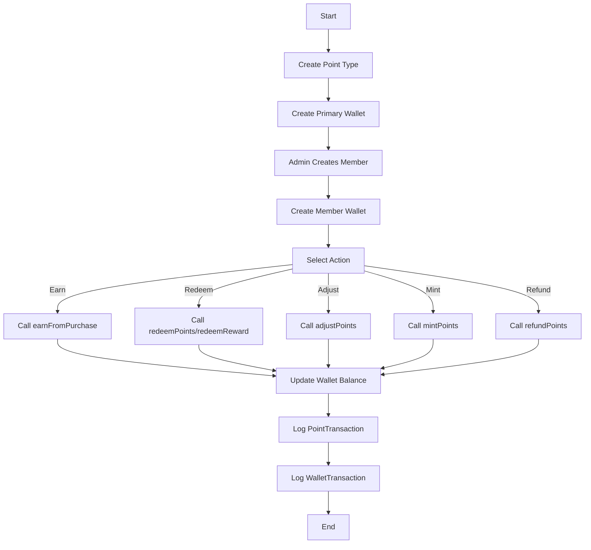
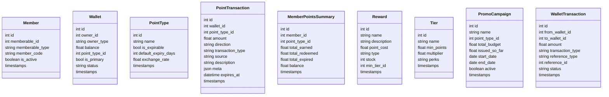

# Architecture

The Member Points Loyalty Program is a modular Laravel application (`Modules\DiscountManagement`) for managing loyalty points, tiers, rewards, and campaigns.

## Database Schema
| Table                  | Key Columns                              | Description                                      |
|------------------------|------------------------------------------|--------------------------------------------------|
| `members`             | `id`, `memberable_id`, `memberable_type`, `member_code`, `is_active` | Polymorphic members. |
| `wallets`             | `id`, `owner_id`, `owner_type`, `balance`, `point_type_id`, `is_primary`, `status` | Points storage. |
| `point_types`         | `id`, `name`, `is_expirable`, `default_expiry_days`, `exchange_rate` | Point definitions. |
| `rewards`             | `id`, `name`, `description`, `point_cost`, `type`, `stock`, `min_tier_id` | Redeemable items. |
| `tiers`               | `id`, `name`, `min_points`, `multiplier`, `perks` | Tier definitions. |
| `member_points_summaries` | `id`, `member_id`, `point_type_id`, `total_earned`, `total_redeemed`, `total_expired`, `balance` | Points tracking. |
| `point_transactions`  | `id`, `wallet_id`, `point_type_id`, `amount`, `direction`, `transaction_type`, `source`, `description`, `meta` | Transaction logs. |
| `campaigns`           | `id`, `name`, `start_date`, `end_date`   | Reward campaigns. |

## ERD

