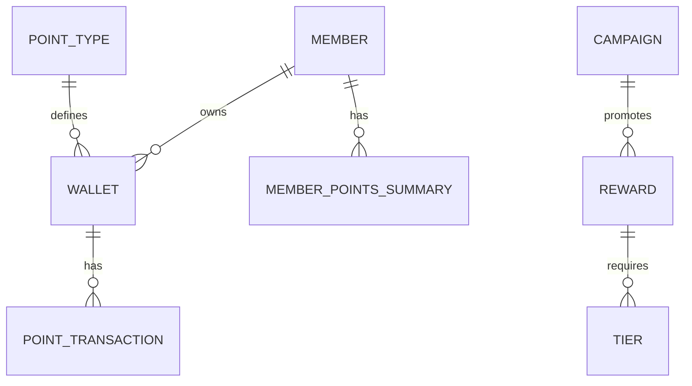

# Architecture

The Member Points Loyalty Program is a modular Laravel application (`Modules\DiscountManagement`) for managing loyalty points, tiers, rewards, and campaigns.

## Components
- **Entities**:
  - `Member`: Polymorphic (`memberable_id`, `memberable_type`) linked to `Contact` or `BusinessUser`.
  - `Wallet`: Stores points (`balance`) with `point_type_id`, `is_primary`.
  - `PointType`: Defines points (`name`, `is_expirable`, `default_expiry_days`, `exchange_rate`).
  - `Reward`: Redeemable items (`point_cost`, `type`, `stock`, `min_tier_id`).
  - `Tier`: Tiers (`min_points`, `multiplier`, `perks`).
  - `MemberPointsSummary`: Tracks `total_earned`, `total_redeemed`, `total_expired`, `balance`.
  - `PointTransaction`: Logs changes (`amount`, `direction`, `transaction_type`, `meta`).
  - `Campaign`: Defines reward promotions (`name`, `start_date`, `end_date`).
- **Services**:
  - `TierService`: Calculates tiers (`getMemberTier`, `getNextTier`).
  - `RewardService`: Manages redemption.
- **Controllers**:
  - `PointTypeController`: Manages point types.
  - `MemberController`: Handles members and dashboard.
  - `WalletController`: Manages earning/redeeming points.
  - `TierController`: Tier CRUD.
  - `RewardController`: Reward CRUD.
  - `CampaignController`: Campaign management.
  - `TransactionController`: Transaction views.
  - `DashboardController`: System overview.
- **Views**:
  - `point-types/*`: Point type management.
  - `members/*`: Member operations and dashboard.
  - `wallets/*`: Wallet actions.
- **Enums**:
  - `TransactionType`: `EARN`, `REDEEM`, `REFUND`, `ADJUST`, `MINT`.

## Database Schema
| Table                  | Key Columns                              | Description                                      |
|------------------------|------------------------------------------|--------------------------------------------------|
| `members`             | `id`, `memberable_id`, `memberable_type`, `member_code`, `is_active` | Polymorphic members. |
| `wallets`             | `id`, `owner_id`, `owner_type`, `balance`, `point_type_id`, `is_primary`, `status` | Points storage. |
| `point_types`         | `id`, `name`, `is_expirable`, `default_expiry_days`, `exchange_rate` | Point definitions. |
| `rewards`             | `id`, `name`, `description`, `point_cost`, `type`, `stock`, `min_tier_id` | Redeemable items. |
| `tiers`               | `id`, `name`, `min_points`, `multiplier`, `perks` | Tier definitions. |
| `member_points_summaries` | `id`, `member_id`, `point_type_id`, `total_earned`, `total_redeemed`, `total_expired`, `balance` | Points tracking. |
| `point_transactions`  | `id`, `wallet_id`, `point_type_id`, `amount`, `direction`, `transaction_type`, `source`, `description`, `meta` | Transaction logs. |
| `campaigns`           | `id`, `name`, `start_date`, `end_date`   | Reward campaigns. |

## ERD

    MEMBER {
        int id
        int memberable_id
        string memberable_type
        string member_code
        boolean is_active
        timestamp created_at
        timestamp updated_at
    }
    WALLET {
        int id
        int owner_id
        string owner_type
        float balance
        int point_type_id
        boolean is_primary
        string status
        timestamp created_at
        timestamp updated_at
    }
    POINT_TYPE {
        int id
        string name
        boolean is_expirable
        int default_expiry_days
        float exchange_rate
        timestamp created_at
        timestamp updated_at
    }
    REWARD {
        int id
        string name
        string description
        float point_cost
        string type
        int stock nullable
        int min_tier_id nullable
        timestamp created_at
        timestamp updated_at
    }
    TIER {
        int id
        string name
        float min_points
        float multiplier
        string perks nullable
        timestamp created_at
        timestamp updated_at
    }
    MEMBER_POINTS_SUMMARY {
        int id
        int member_id
        int point_type_id
        float total_earned
        float total_redeemed
        float total_expired
        float balance
        timestamp created_at
        timestamp updated_at
    }
    POINT_TRANSACTION {
        int id
        int wallet_id
        int point_type_id
        float amount
        string direction
        string transaction_type
        string source
        string description nullable
        json meta nullable
        timestamp created_at
        timestamp updated_at
    }
    CAMPAIGN {
        int id
        string name
        date start_date
        date end_date
        timestamp created_at
        timestamp updated_at
    }
