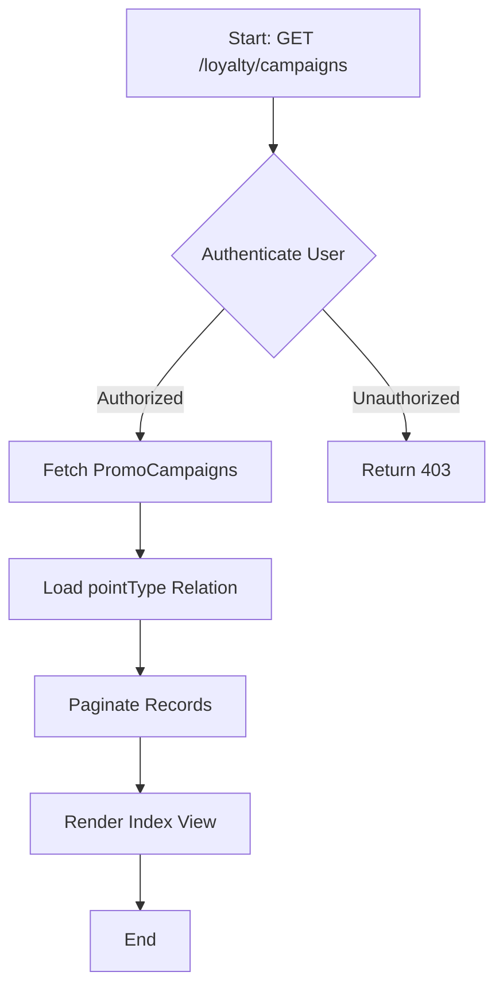
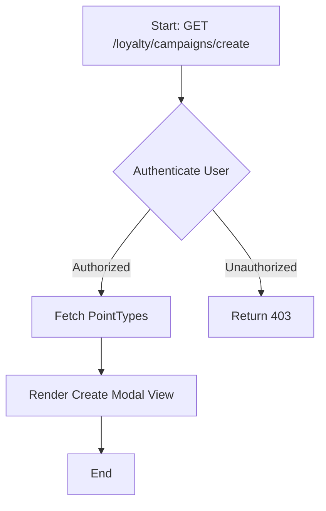
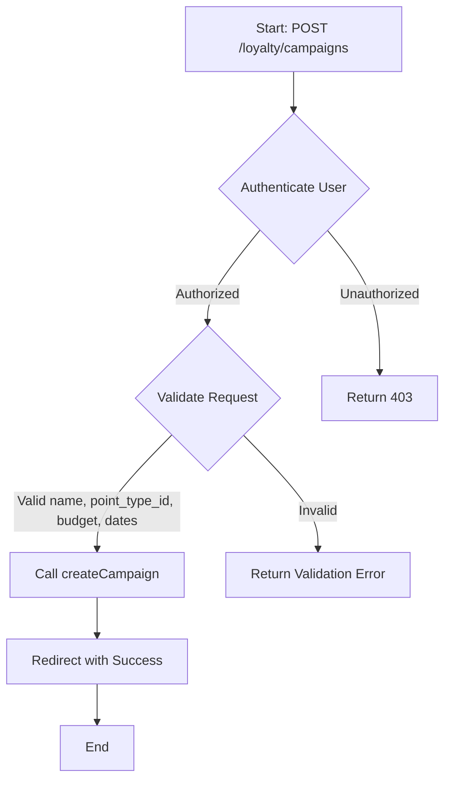
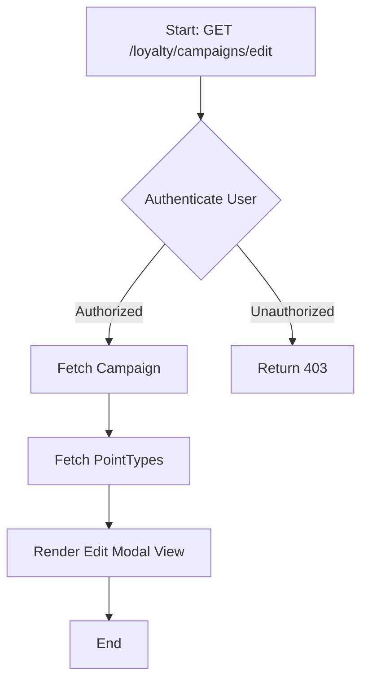
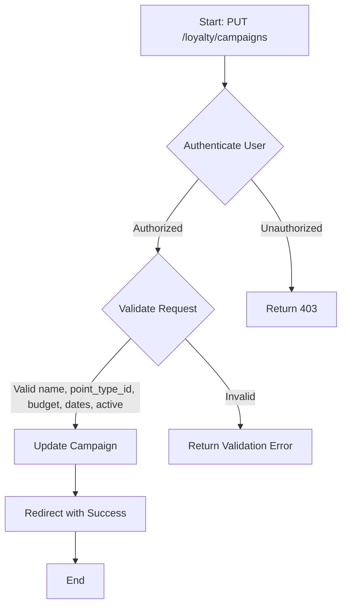
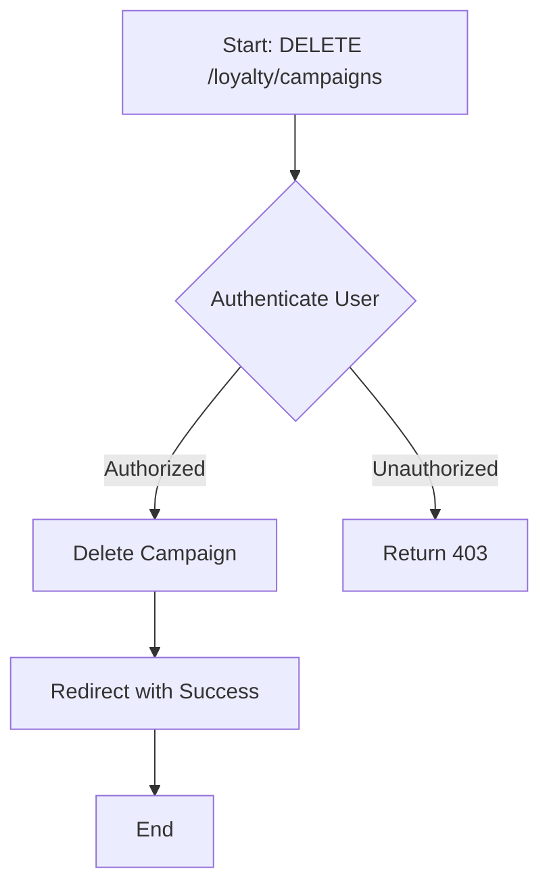
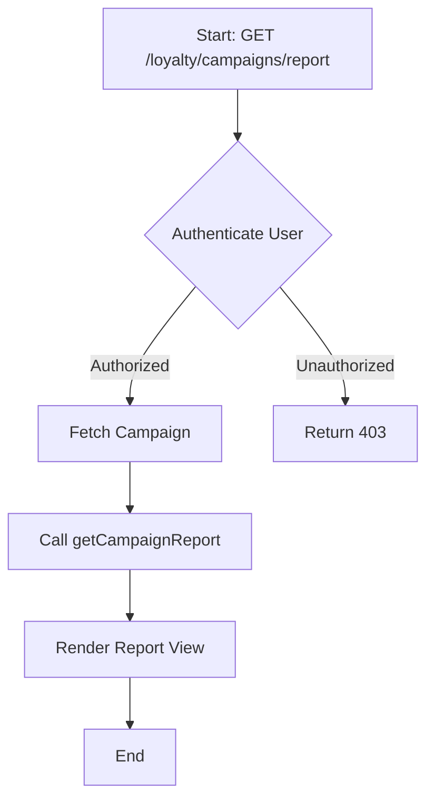

# Campaign Management

The campaign management module allows you to create, manage, and generate reports for promotional campaigns.

## Key Components

### Routes

The following routes are defined for managing campaigns:

- `GET /loyalty/campaigns`: List all campaigns.
- `GET /loyalty/campaigns/create`: Show form to create a new campaign.
- `POST /loyalty/campaigns`: Store a new campaign.
- `GET /loyalty/campaigns/{campaign}/edit`: Show form to edit a specific campaign.
- `PUT/PATCH /loyalty/campaigns/{campaign}`: Update a specific campaign.
- `GET /loyalty/campaigns/{campaign}/confirm-delete`: Confirm deletion of a campaign.
- `DELETE /loyalty/campaigns/{campaign}`: Delete a specific campaign.
- `GET /loyalty/campaigns/{campaign}/report`: Generate report for a specific campaign.

### Controllers

The `CampaignController` is responsible for handling campaign-related operations. Here are some key methods:

- **Index**
  - `index()`: List all campaigns.
  
- **Create**
  - `create()`: Show form to create a new campaign.
  
- **Store**
  - `store(Request $request, PromoCampaignServiceInterface $campaignService)`: Store a new campaign.
  
- **Edit**
  - `edit(PromoCampaign $campaign)`: Show form to edit a specific campaign.
  
- **Update**
  - `update(Request $request, PromoCampaign $campaign)`: Update a specific campaign.
  
- **Confirm Delete**
  - `confirmDelete(PromoCampaign $campaign)`: Confirm deletion of a specific campaign.
  
- **Destroy**
  - `destroy(PromoCampaign $campaign)`: Delete a specific campaign.
  
- **Report**
  - `report(PromoCampaign $campaign, PromoCampaignServiceInterface $campaignService)`: Generate report for a specific campaign.

### Services

The `PromoCampaignServiceInterface` defines methods for handling promotional campaigns:

- **Create Campaign**
  - `createCampaign(string $name, int $pointTypeId, float $totalBudget, \DateTime $startDate, \DateTime $endDate): int`: Create a new campaign.
  
- **Issue Promo Points**
  - `issuePromoPoints(int $memberId, int $pointTypeId, float $amount, string $campaignName, ?int $campaignId = null): void`: Issue promo points to a member.
  
- **Update Campaign Status**
  - `updateCampaignStatus(int $campaignId, bool $active): void`: Update the status of a campaign.
  
- **Check Campaign Status**
  - `checkCampaignStatus(): void`: Check the status of all campaigns.
  
- **Get Campaign Report**
  - `getCampaignReport(int $campaignId): array`: Generate a report for a specific campaign.

## WORKFLOW
- **List Campaigns**:

- **Show Create Campaign Form**:

- **Create Campaign**:

- **Show Edit Campaign Form**:

- **Update Campaign**:

- **Delete Campaign**:

- **View Campaign Report**:
