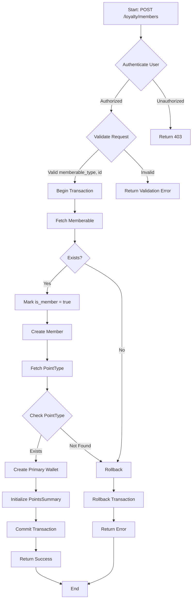
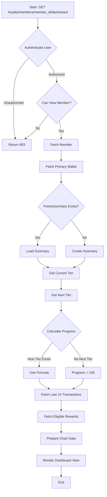

# Member Management

The member management module allows you to create, manage, and view member details, wallets, and dashboards.

## Key Components

### Routes

The following routes are defined for managing members:

- `GET /loyalty/members`: List all members.
- `GET /loyalty/members/create`: Show form to create a new member.
- `POST /loyalty/members`: Store a new member.
- `GET /loyalty/members/{member}/wallets`: List wallets for a specific member.
- `GET /loyalty/members/{member}/dashboard`: Show dashboard for a specific member.

### Controllers

The `MemberController` is responsible for handling member-related operations. Here are some key methods:

- **Index**
  - `index()`: List all members.
  
- **Create**
  - `create()`: Show form to create a new member. Retrieves contacts and business users who are not yet members.
  
- **Store**
  - `store(Request $request)`: Store a new member. Validates input data, marks the entity as a member, creates a primary wallet, and initializes a points summary.
  
- **Wallets**
  - `wallets(Member $member)`: List wallets for a specific member.
  
- **Dashboard**
  - `dashboard(Request $request, Member $member, TierServiceInterface $tierService)`: Show dashboard for a specific member. Displays wallet details, points summary, tier progress, transactions, and available rewards.

### Entities

The `Member` entity represents a member in the system. Here are the key attributes:

- `id`: Unique identifier for the member.
- `member_code`: Unique code for the member.
- `memberable_id`: ID of the memberable entity (either a `Contact` or `BusinessUser`).
- `memberable_type`: Type of the memberable entity (either `App\Models\Contact\Contact` or `App\Models\BusinessUser`).
- `is_active`: Boolean indicating whether the member is active.

The `MemberPointsSummary` entity keeps track of the points summary for each member. Here are the key attributes:

- `id`: Unique identifier for the points summary.
- `member_id`: ID of the member.
- `point_type_id`: ID of the point type.
- `total_earned`: Total points earned by the member.
- `total_redeemed`: Total points redeemed by the member.
- `total_expired`: Total points expired by the member.
- `balance`: Current balance of points for the member.

### Services

The `TierServiceInterface` defines methods for handling tiers:

- **Get Member Tier**
  - `getMemberTier(Member $member): ?Tier`: Get the tier for a specific member.
  
- **Apply Tier Multiplier**
  - `applyTierMultiplier(Member $member, float $points): float`: Apply the tier multiplier to points earned by a member.
  
- **Get All Tiers**
  - `getAllTiers(): Collection<int, Tier>`: Get all tiers in ascending order of required points.
  
- **Get Next Tier**
  - `getNextTier(Member $member): ?Tier`: Get the next tier based on a member's total earned points.

## WORKFLOW
- **Create Member**:

- **Render Member Dashboard**:
