# Member Point System

The member point system is a core component of the Discount Management module. It handles the accumulation, redemption, and management of points for members.

## Key Components

### Routes

The following routes are defined for managing point types, members, transactions, wallets, campaigns, tiers, rewards, and dashboards:

- **Point Types**
  - `GET /loyalty/point-types`: List all point types (`loyalty.point-types.index`).
  - `GET /loyalty/point-types/create`: Show form to create a point type (`loyalty.point-types.create`).
  - `POST /loyalty/point-types`: Store a point type (`loyalty.point-types.store`).
  - `GET /loyalty/point-types/{pointType}/edit`: Show form to edit a point type (`loyalty.point-types.edit`).
  - `PUT /loyalty/point-types/{pointType}`: Update a point type (`loyalty.point-types.update`).
  - `GET /loyalty/point-types/{pointType}/confirm-delete`: Confirm deletion (`loyalty.point-types.delete`).
  - `DELETE /loyalty/point-types/{pointType}`: Delete a point type (`loyalty.point-types.destroy`).

- **Members**
  - `GET /loyalty/members`: List all members (`loyalty.members.index`).
  - `GET /loyalty/members/create`: Show form to create a member (`loyalty.members.create`).
  - `POST /loyalty/members`: Store a member (`loyalty.members.store`).
  - `GET /loyalty/members/{member}/edit`: Show form to edit a member (`loyalty.members.edit`).
  - `PUT /loyalty/members/{member}`: Update a member (`loyalty.members.update`).
  - `GET /loyalty/members/{member}/wallets`: List member wallets (`loyalty.members.wallets`).
  - `GET /loyalty/members/{member}/dashboard`: Show member dashboard (`loyalty.members.dashboard`).

- **Transactions**
  - `GET /loyalty/transactions/point`: List point transactions (`loyalty.transactions.point`).
  - `GET /loyalty/transactions/wallet`: List wallet transactions (`loyalty.transactions.wallet`).

- **Wallets**
  - `GET /loyalty/wallets`: List all wallets (`loyalty.wallets.index`).
  - `POST /loyalty/wallets`: Create a wallet (`loyalty.wallets.store`).
  - `GET /loyalty/wallets/{wallet}/balance`: Get wallet balance (`loyalty.wallets.balance`).
  - `GET /loyalty/wallets/{member}/earn`: Show earn modal (`loyalty.wallets.earn-modal`).
  - `POST /loyalty/wallets/earn/erp`: Earn points from ERP (`loyalty.wallets.earn.erp`).
  - `POST /loyalty/wallets/earn/pos`: Earn points from POS (`loyalty.wallets.earn.pos`).
  - `POST /loyalty/wallets/earn/ecommerce`: Earn points from eCommerce (`loyalty.wallets.earn.ecommerce`).
  - `GET /loyalty/wallets/{wallet}/redeem`: Show redeem modal (`loyalty.wallets.redeem-modal`).
  - `POST /loyalty/wallets/{wallet}/redeem`: Redeem points (`loyalty.wallets.redeem`).
  - `GET /loyalty/wallets/{wallet}/refund`: Show refund modal (`loyalty.wallets.refund-modal`).
  - `POST /loyalty/wallets/refund`: Refund points (`loyalty.wallets.refund`).
  - `GET /loyalty/wallets/{wallet}/adjust`: Show adjust modal (`loyalty.wallets.adjust-modal`).
  - `POST /loyalty/wallets/{wallet}/adjust`: Adjust points (`loyalty.wallets.adjust`).
  - `GET /loyalty/wallets/{wallet}/mint-modal`: Show mint modal (`loyalty.wallets.mint-modal`).
  - `POST /loyalty/wallets/{wallet}/mint`: Mint points (`loyalty.wallets.mint`).
  - `GET /loyalty/wallets/{wallet}/ledger`: Show wallet ledger (`loyalty.wallets.ledger`).
  - `GET /loyalty/wallets/{member}/available-wallets`: List available wallets (`loyalty.wallets.available-wallets`).

- **Campaigns**
  - `GET /loyalty/campaigns`: List all campaigns (`loyalty.campaigns.index`).
  - `GET /loyalty/campaigns/create`: Show form to create a campaign (`loyalty.campaigns.create`).
  - `POST /loyalty/campaigns`: Store a campaign (`loyalty.campaigns.store`).
  - `GET /loyalty/campaigns/{campaign}/edit`: Show form to edit a campaign (`loyalty.campaigns.edit`).
  - `PUT /loyalty/campaigns/{campaign}`: Update a campaign (`loyalty.campaigns.update`).
  - `GET /loyalty/campaigns/{campaign}/confirm-delete`: Confirm deletion (`loyalty.campaigns.delete`).
  - `DELETE /loyalty/campaigns/{campaign}`: Delete a campaign (`loyalty.campaigns.destroy`).
  - `GET /loyalty/campaigns/{campaign}/report`: Generate campaign report (`loyalty.campaigns.report`).

- **Tiers**
  - `GET /loyalty/tiers`: List all tiers (`loyalty.tiers.index`).
  - `GET /loyalty/tiers/create`: Show form to create a tier (`loyalty.tiers.create`).
  - `POST /loyalty/tiers`: Store a tier (`loyalty.tiers.store`).
  - `GET /loyalty/tiers/{tier}/edit`: Show form to edit a tier (`loyalty.tiers.edit`).
  - `PUT /loyalty/tiers/{tier}`: Update a tier (`loyalty.tiers.update`).
  - `GET /loyalty/tiers/{tier}/confirm-delete`: Confirm deletion (`loyalty.tiers.delete`).
  - `DELETE /loyalty/tiers/{tier}`: Delete a tier (`loyalty.tiers.destroy`).

- **Rewards**
  - `GET /loyalty/rewards`: List all rewards (`loyalty.rewards.index`).
  - `GET /loyalty/rewards/create`: Show form to create a reward (`loyalty.rewards.create`).
  - `POST /loyalty/rewards`: Store a reward (`loyalty.rewards.store`).
  - `GET /loyalty/rewards/{reward}/edit`: Show form to edit a reward (`loyalty.rewards.edit`).
  - `PUT /loyalty/rewards/{reward}`: Update a reward (`loyalty.rewards.update`).
  - `GET /loyalty/rewards/{reward}/confirm-delete`: Confirm deletion (`loyalty.rewards.delete`).
  - `DELETE /loyalty/rewards/{reward}`: Delete a reward (`loyalty.rewards.destroy`).
  - `GET /loyalty/rewards/catalog`: Show rewards catalog (`loyalty.rewards.catalog`).

- **Dashboard**
  - `GET /loyalty/dashboard`: Show system dashboard (`loyalty.dashboard`).

### Controllers

The following controllers manage the member point system:

- **PointTypeController**:
  - **Index**: `index()`: Lists all point types.
  - **Create**: `create()`: Shows form to create a point type.
  - **Store**: `store(Request $request)`: Stores a point type.
  - **Edit**: `edit(PointType $pointType)`: Shows form to edit a point type.
  - **Update**: `update(Request $request, PointType $pointType)`: Updates a point type.
  - **Confirm Delete**: `confirmDelete(PointType $pointType)`: Shows delete confirmation modal.
  - **Destroy**: `destroy(PointType $pointType)`: Deletes a point type.

- **MemberController**:
  - **Index**: `index()`: Lists all members.
  - **Create**: `create()`: Shows form to create a member, retrieving contacts and business users.
  - **Store**: `store(Request $request)`: Stores a member, creates wallet, initializes points summary.
  - **Edit**: `edit(Member $member)`: Shows form to edit a member.
  - **Update**: `update(Request $request, Member $member)`: Updates a member.
  - **Wallets**: `wallets(Member $member)`: Lists member wallets.
  - **Dashboard**: `dashboard(Request $request, Member $member, TierServiceInterface $tierService)`: Shows member dashboard.

- **TransactionController**:
  - **Point Transactions**: `pointTransactions()`: Lists point transactions with formatted details.
  - **Wallet Transactions**: `walletTransactions()`: Lists wallet transactions with formatted details.

- **WalletController**:
  - **Index**: `index()`: Lists all wallets.
  - **Create**: `create(Request $request, WalletServiceInterface $walletService)`: Creates a wallet.
  - **Get Balance**: `getBalance(Wallet $wallet)`: Gets wallet balance.
  - **Earn Modal**: `earnModal(Member $member)`: Shows earn points modal.
  - **Earn Points**: `earnFromErp`, `earnFromPos`, `earnFromEcommerce`: Earns points via `PointEarningService`.
  - **Redeem Modal**: `redeemModal(Wallet $wallet)`: Shows redeem modal.
  - **Redeem Reward**: `redeem(Request $request, Wallet $wallet, RewardServiceInterface $rewardService)`: Redeems reward.
  - **Refund Modal**: `refundModal(Wallet $wallet)`: Shows refund modal.
  - **Refund Points**: `refund(Request $request, PointRefundServiceInterface $refundService)`: Refunds points.
  - **Adjust Modal**: `adjustModal(Wallet $wallet)`: Shows adjust modal.
  - **Adjust Points**: `adjust(Request $request, Wallet $wallet, PointAdjustmentServiceInterface $adjustService)`: Adjusts points.
  - **Mint Modal**: `mintModal(Wallet $wallet)`: Shows mint modal.
  - **Mint Points**: `mint(Request $request, Wallet $wallet, PointAdjustmentServiceInterface $adjustService)`: Mints points.
  - **Ledger**: `ledger(Wallet $wallet)`: Views wallet ledger.
  - **Available Wallets**: `availableWallets(Request $request, Member $member)`: Gets member wallets.

- **CampaignController**:
  - **Index**: `index()`: Lists campaigns with point types.
  - **Create**: `create()`: Shows campaign creation form.
  - **Store**: `store(Request $request, PromoCampaignServiceInterface $campaignService)`: Creates campaign.
  - **Edit**: `edit(PromoCampaign $campaign)`: Shows edit form.
  - **Update**: `update(Request $request, PromoCampaign $campaign)`: Updates campaign.
  - **Confirm Delete**: `confirmDelete(PromoCampaign $campaign)`: Shows delete modal.
  - **Destroy**: `destroy(PromoCampaign $campaign)`: Deletes campaign.
  - **Report**: `report(PromoCampaign $campaign, PromoCampaignServiceInterface $campaignService)`: Views campaign report.

- **TierController**:
  - **Index**: `index()`: Lists tiers.
  - **Create**: `create()`: Shows tier creation form.
  - **Store**: `store(Request $request)`: Creates tier.
  - **Edit**: `edit(Tier $tier)`: Shows edit form.
  - **Update**: `update(Request $request, Tier $tier)`: Updates tier.
  - **Confirm Delete**: `confirmDelete(Tier $tier)`: Shows delete modal.
  - **Destroy**: `destroy(Tier $tier)`: Deletes tier.

- **RewardController**:
  - **Index**: `index()`: Lists rewards.
  - **Create**: `create()`: Shows reward creation form.
  - **Store**: `store(Request $request)`: Creates reward.
  - **Edit**: `edit(Reward $reward)`: Shows edit form.
  - **Update**: `update(Request $request, Reward $reward)`: Updates reward.
  - **Confirm Delete**: `confirmDelete(Reward $reward)`: Shows delete modal.
  - **Destroy**: `destroy(Reward $reward)`: Deletes reward.
  - **Catalog**: `catalog()`: Displays reward catalog.

- **DashboardController**:
  - **Dashboard**: `dashboard(TierServiceInterface $tierService)`: Shows system-wide points activity and tier distribution.

### Entities

The `Member` entity:

- `id`: Unique identifier.
- `member_code`: Unique code.
- `memberable_id`: ID of memberable entity (`Contact` or `BusinessUser`).
- `memberable_type`: Type (`App\Models\Contact\Contact` or `App\Models\BusinessUser`).
- `is_active`: Boolean.
- `tier_id`: Associated tier ID (nullable).

The `MemberPointsSummary` tracks points:

- `id`: Unique identifier.
- `member_id`: Member ID.
- `point_type_id`: Point type ID.
- `total_earned`: Total points earned.
- `total_redeemed`: Points redeemed.
- `total_expired`: Points expired.
- `balance`: Current balance.

The `PointTransaction` tracks point changes:

- `id`: Unique identifier.
- `wallet_id`: Wallet ID.
- `amount`: Points amount.
- `direction`: In or out.
- `transaction_type`: Type (e.g., EARN, REDEEM, REFUND, ADJUST, MINT, ISSUE).
- `source`: Source (e.g., Sale, Mint, Manual).
- `expires_at`: Expiry date.
- `status`: Transaction status.

The `WalletTransaction` tracks transfers:

- `id`: Unique identifier.
- `from_wallet_id`: Source wallet ID.
- `to_wallet_id`: Destination wallet ID.
- `amount`: Points transferred.
- `transaction_type`: Type (e.g., Transfer, Refund, Redeem, Adjust, Mint).
- `reference_type`: Reference type (e.g., PointTransaction, Sale, Manual).
- `reference_id`: Reference ID.

The `Wallet` stores points:

- `id`: Unique identifier.
- `owner_id`: Owner ID (Member or PointType).
- `owner_type`: Owner type (Member or PointType).
- `point_type_id`: Point type ID.
- `balance`: Points balance.
- `is_primary`: Primary wallet flag.
- `status`: Wallet status.

The `Reward` defines rewards:

- `id`: Unique identifier.
- `name`: Reward name.
- `description`: Description (nullable).
- `point_cost`: Points required.
- `type`: Reward type (discount or product).
- `stock`: Available stock.
- `min_tier_id`: Minimum tier ID (nullable).

The `PromoCampaign` defines campaigns:

- `id`: Unique identifier.
- `name`: Campaign name.
- `point_type_id`: Point type ID.
- `total_budget`: Points budget.
- `issued_so_far`: Points issued.
- `start_date`: Start date.
- `end_date`: End date.
- `active`: Boolean.

The `Tier` defines tiers:

- `id`: Unique identifier.
- `name`: Tier name.
- `min_points`: Minimum points required.
- `multiplier`: Points multiplier.
- `perks`: Benefits (nullable).

The `PointType` defines point types:

- `id`: Unique identifier.
- `name`: Point type name.
- `description`: Description (nullable).

### Services

The following services handle different aspects of the point system:

- **TierServiceInterface**:
  - `getMemberTier(Member $member): ?Tier`: Gets tier for a member.
  - `applyTierMultiplier(Member $member, float $points): float`: Applies tier multiplier.
  - `getAllTiers(): Collection<int, Tier>`: Gets all tiers.
  - `getNextTier(Member $member): ?Tier`: Gets next tier for a member.

- **WalletServiceInterface**:
  - `getWallet(int $ownerId, string $ownerType, int $pointTypeId, bool $isPrimary): Wallet`: Gets/creates wallet.
  - `getWalletByPointType(int $pointTypeId): Wallet`: Gets system wallet by point type.

- **PointEarningServiceInterface**:
  - `earnPoints(Wallet $fromWallet, Wallet $toWallet, float $amount, string $source, ?string $referenceType = null, ?int $referenceId = null, ?string $description = null)`: Earns points.
  - `earnFromPurchase(Wallet $toWallet, float $amount, string $channel, ?string $referenceType = null, ?int $referenceId = null, ?string $description = null)`: Earns points from purchase.
  - `issuePoints(Wallet $wallet, float $amount, string $source, ?string $description = null)`: Issues points.

- **RewardServiceInterface**:
  - `redeemReward(Wallet $wallet, int $rewardId, ?string $referenceType = null, ?int $referenceId = null, ?string $description = null)`: Redeems reward.

- **PointRefundServiceInterface**:
  - `refundPoints(Wallet $fromWallet, Wallet $toWallet, float $amount, string $referenceType, int $referenceId, ?string $description = null)`: Refunds points.

- **PointAdjustmentServiceInterface**:
  - `adjustPoints(Wallet $wallet, float $amount, string $reason)`: Adjusts points.
  - `mintPoints(Wallet $wallet, float $amount, string $reason)`: Mints points.

- **PromoCampaignServiceInterface**:
  - `createCampaign(string $name, int $pointTypeId, float $totalBudget, \DateTime $startDate, \DateTime $endDate): int`: Creates campaign.
  - `issuePromoPoints(int $memberId, int $pointTypeId, float $amount, string $campaignName, ?int $campaignId)`: Issues points.
  - `updateCampaignStatus(int $campaignId, bool $active)`: Toggles status.
  - `checkCampaignStatus()`: Checks status.
  - `getCampaignReport(int $campaignId): array`: Returns report.

### Service Operations

**PointAdjustmentService**
- **Adjust Points**:
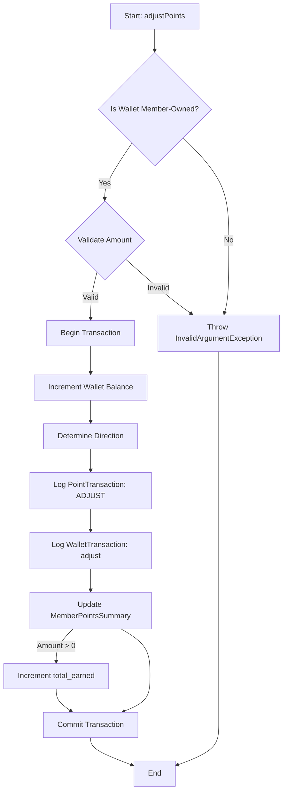
- **Mint Points**:
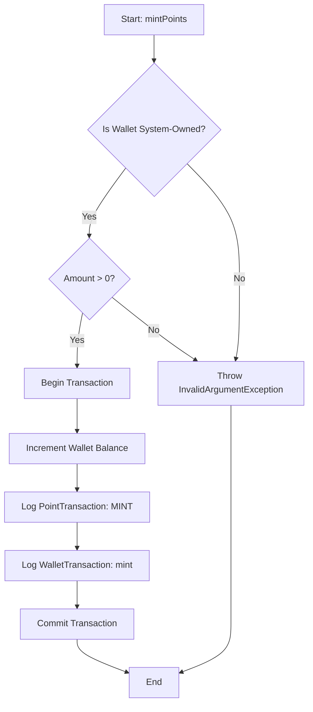

**PointEarningService**
- **Earn Points**:
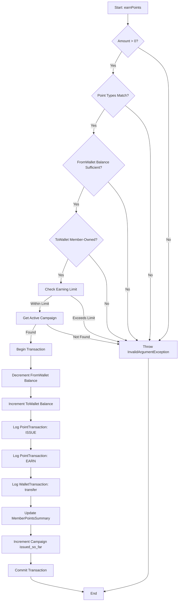
- **Earn From Purchase**:
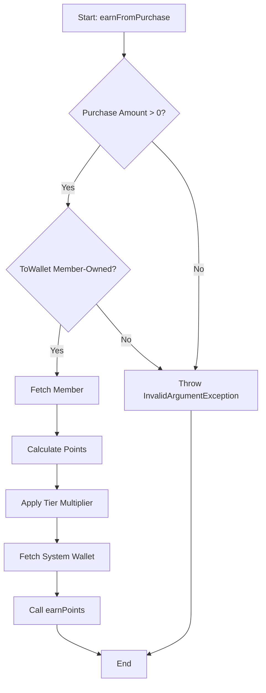
- **Issue Points**:
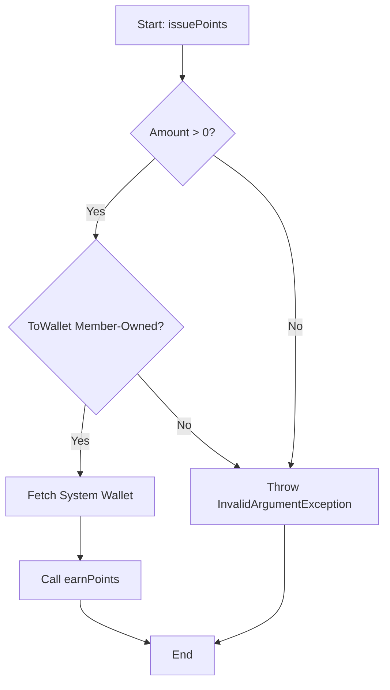


**PointRedemptionService**
- **Redeem Points**:
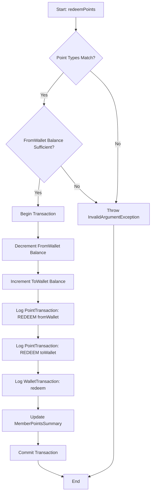

**PointRefundService**
- **Refund Points**:
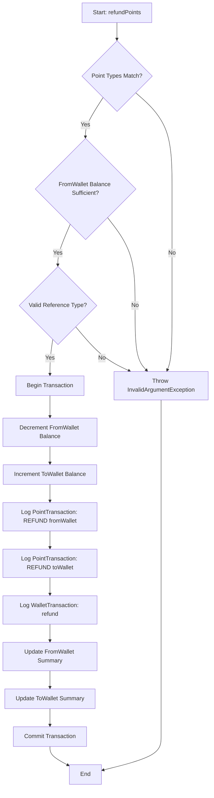

**PromoCampaignService**
- **Create Campaign**:
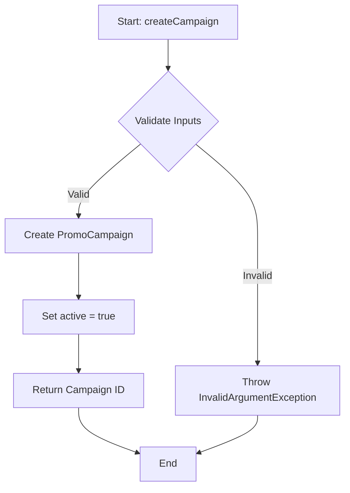
- **Issue Promo Points**:
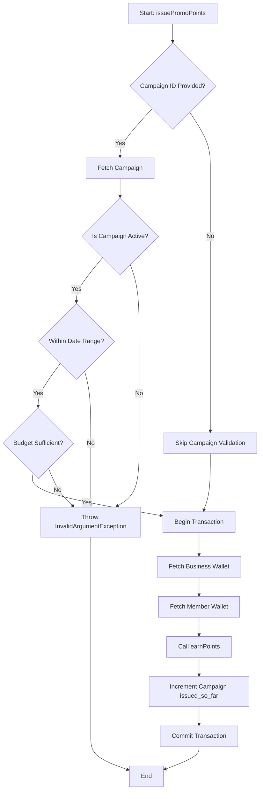
- **Update Campaign Status**:
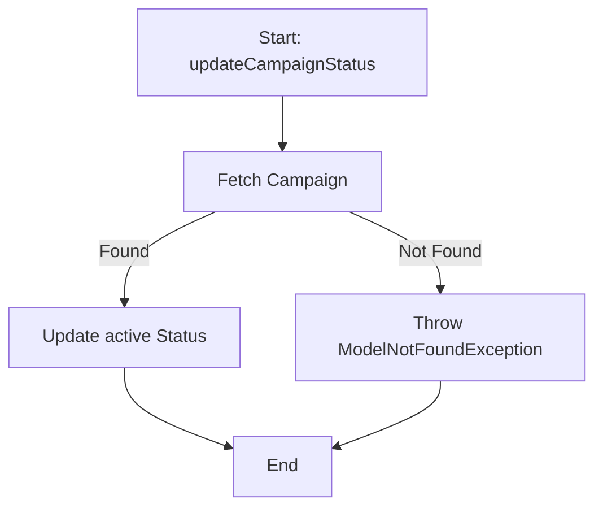
- **Check Campaign Status**:
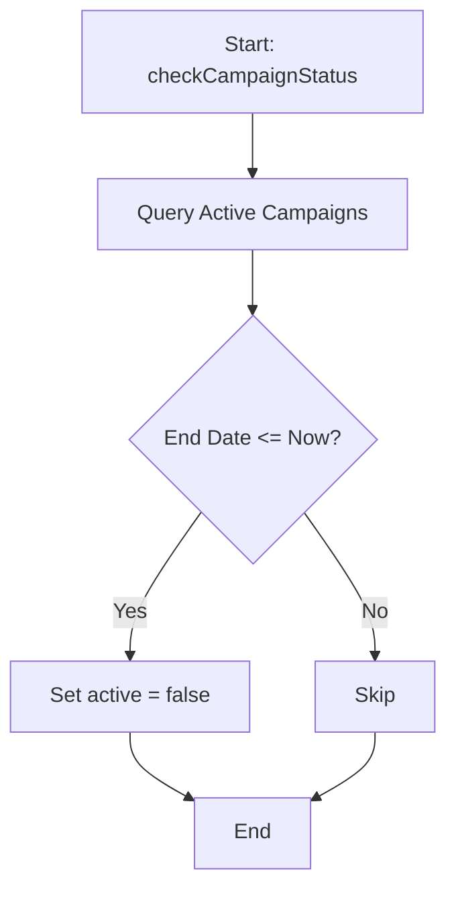
- **Get Campaign Report**:
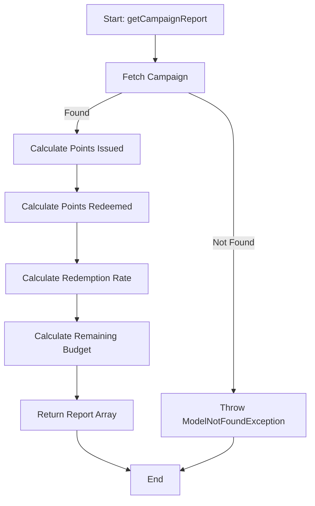


**RewardService**
- **Redeem Reward**:
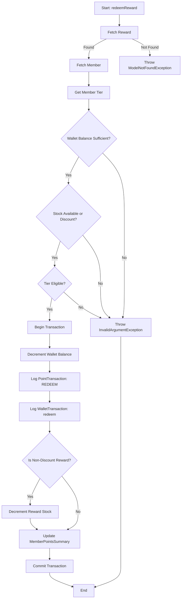
**TierService**
- **Get Member Tier**:
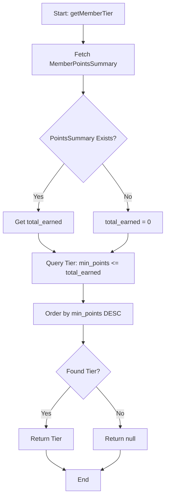
- **Apply Tier Multiplier**:
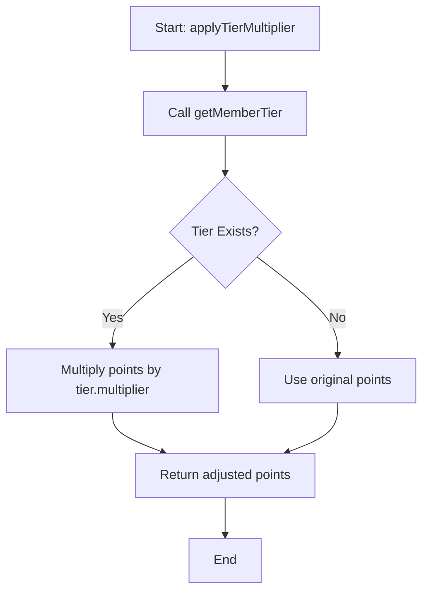
- **Get All Tiers**:
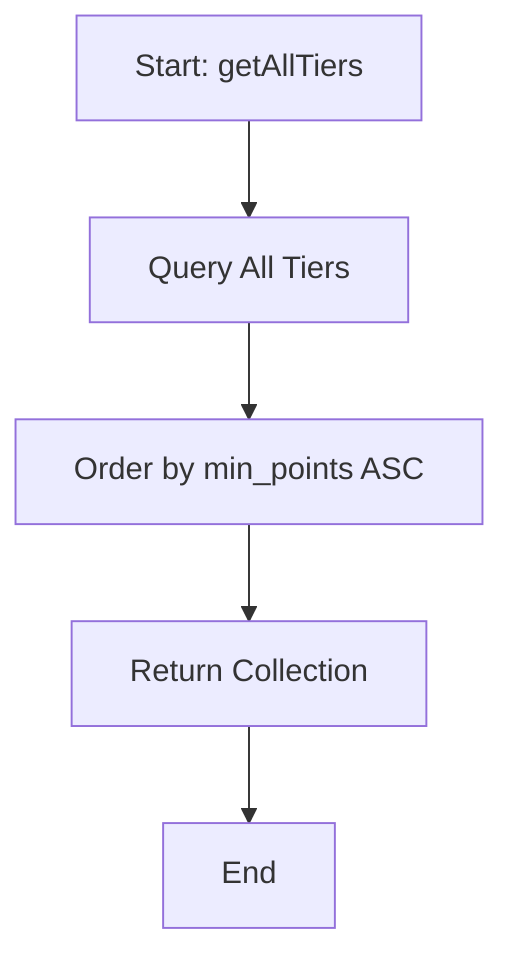
- **Get Next Tier**:
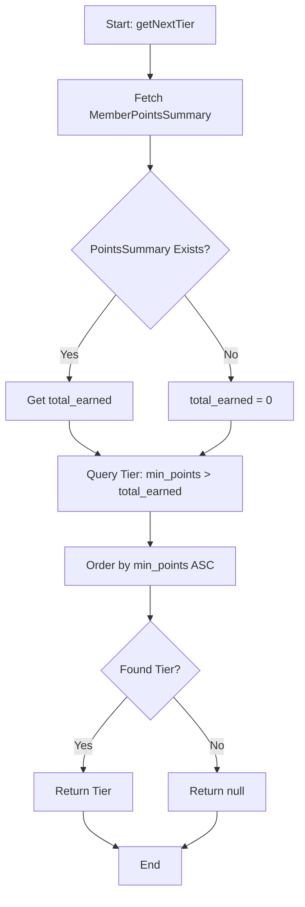

**WalletService**
- **Get Wallet**:
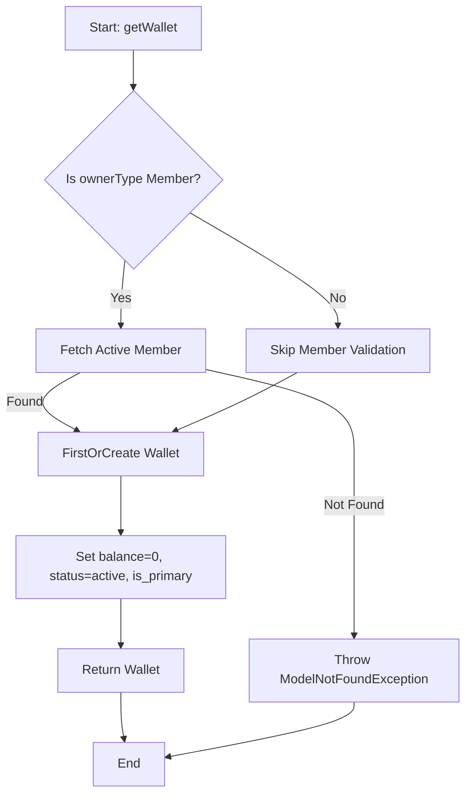
- **Get Wallet By Point Type**:
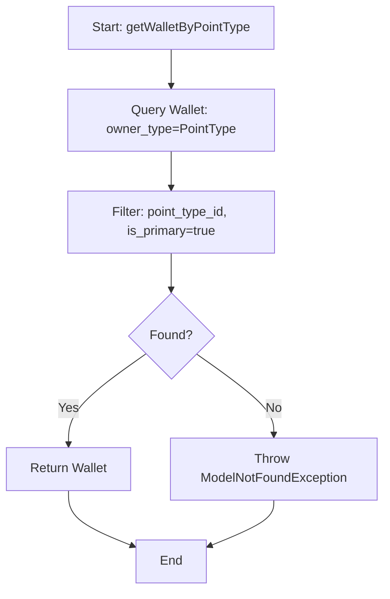


**WalletTransactionLogger**
- **Log Point Transaction**:
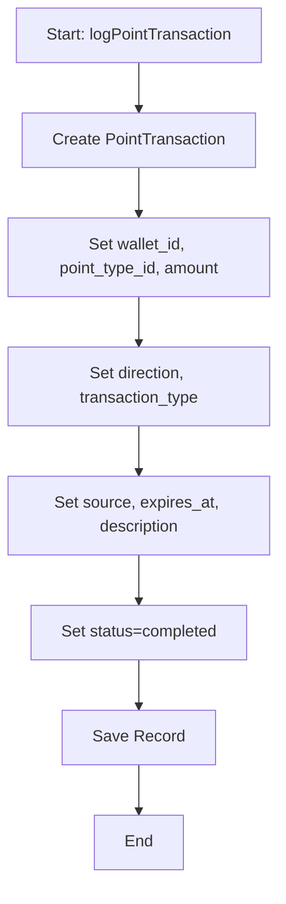
- **Log Wallet Transaction**:
```mermaid
graph TD
    A[Start: logWalletTransaction] --> B[Create WalletTransaction]
    B --> C[Set from_wallet_id, to_wallet_id, amount]
    C --> D[Set transaction_type, reference_type, reference_id]
    D --> E[Set status=completed]
    E --> F[Save Record]
    F --> G[End]
```    