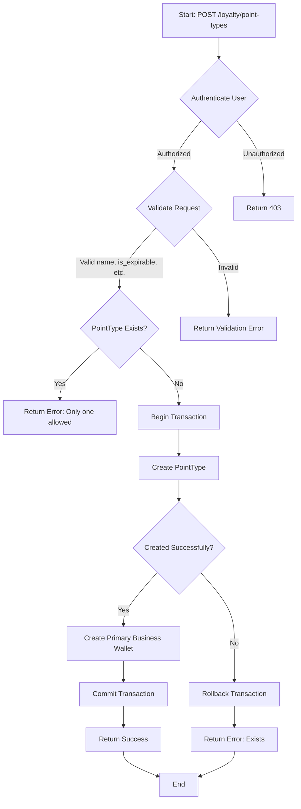
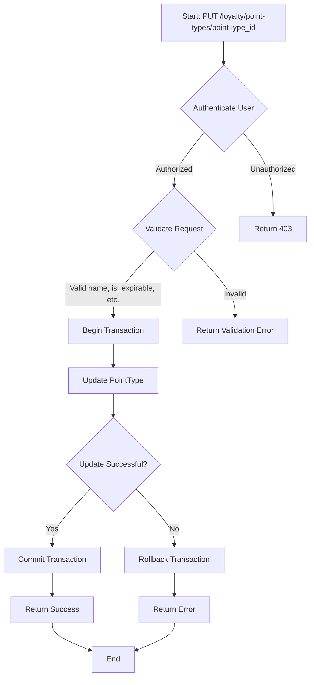
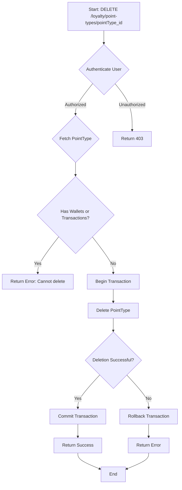

# Point Type Management

The point type management module allows you to create, manage, and single point types for the member point system.

## Key Components

### Routes

The following routes are defined for managing point types:

- `GET /loyalty/point-types`: List all point types.
- `GET /loyalty/point-types/create`: Show form to create a new point type.
- `POST /loyalty/point-types`: Store a new point type.
- `GET /loyalty/point-types/{pointType}/edit`: Show form to edit a specific point type.
- `PUT/PATCH /loyalty/point-types/{pointType}`: Update a specific point type.
- `GET /loyalty/point-types/{pointType}/confirm-delete`: Confirm deletion of a specific point type.
- `DELETE /loyalty/point-types/{pointType}`: Delete a specific point type.

### Controllers

The `PointTypeController` is responsible for handling point type-related operations. Here are some key methods:

- **Index**
  - `index()`: List all point types.
  
- **Create**
  - `create(Request $request)`: Show form to create a new point type. Ensures that only one point type is allowed.
  
- **Store**
  - `store(Request $request)`: Store a new point type. Validates input data and creates a business wallet (primary) for the point type.
  
- **Edit**
  - `edit(PointType $pointType)`: Show form to edit a specific point type.
  
- **Update**
  - `update(Request $request, PointType $pointType)`: Update a specific point type. Validates input data and updates the point type.
  
- **Confirm Delete**
  - `confirmDelete(PointType $pointType)`: Confirm deletion of a specific point type. Checks if the point type has associated wallets or transactions.
  
- **Destroy**
  - `destroy(PointType $pointType)`: Delete a specific point type. Checks if the point type has associated wallets or transactions.

### Entities

The `PointType` entity represents a point type in the system. Here are the key attributes:

- `id`: Unique identifier for the point type.
- `name`: Name of the point type.
- `is_expirable`: Boolean indicating whether points expire.
- `default_expiry_days`: Default number of days for point expiration.
- `exchange_rate`: Exchange rate for converting points to currency.

### Services

No specific services are directly related to the `PointTypeController`. However, the controller interacts with the `Wallet` entity to create a primary business wallet for the point type.

## WORKFLOW
- **Create Point Type**:

- **Update Point Type**:

- **Delete Point Type**:
