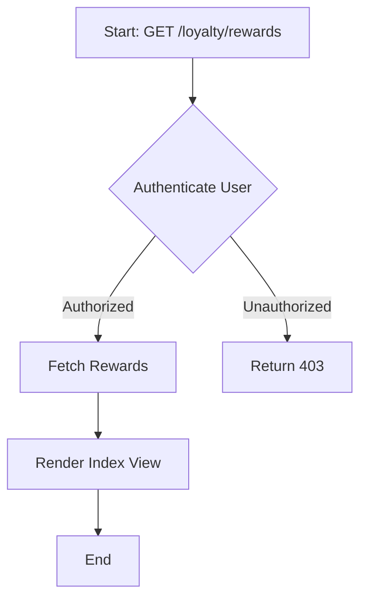
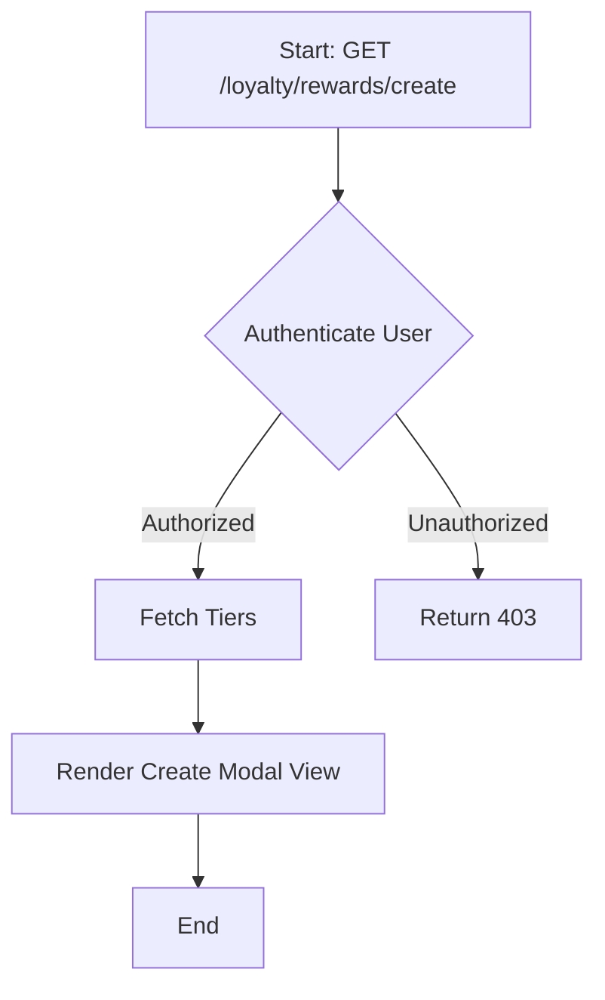
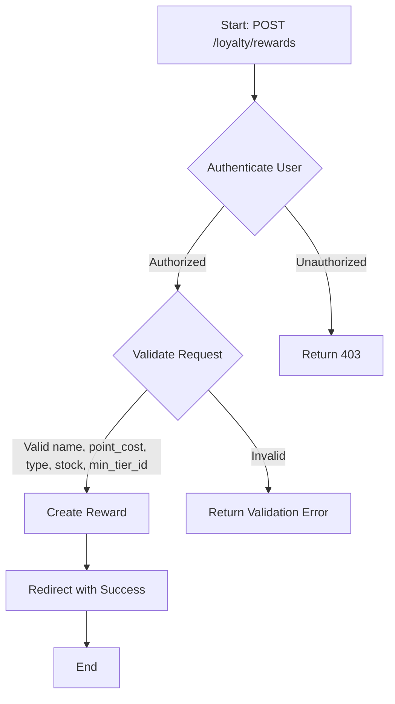
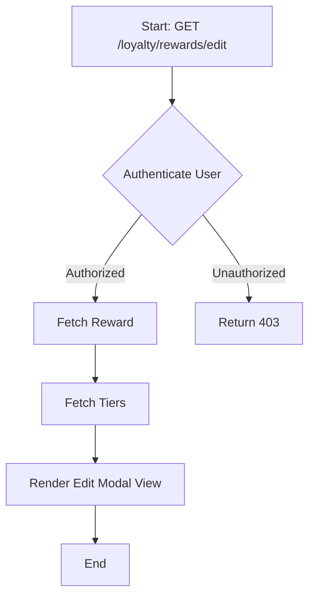
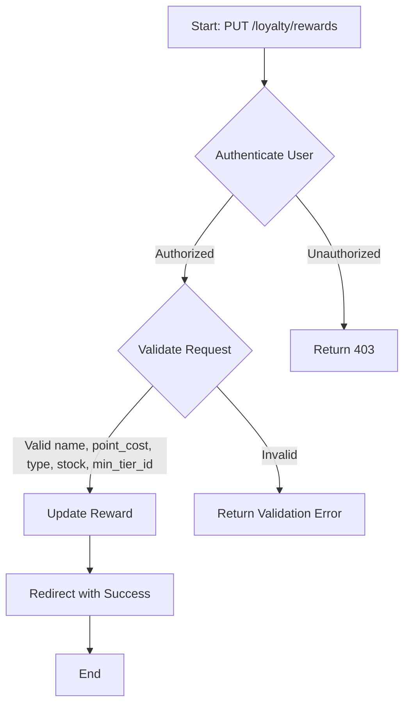
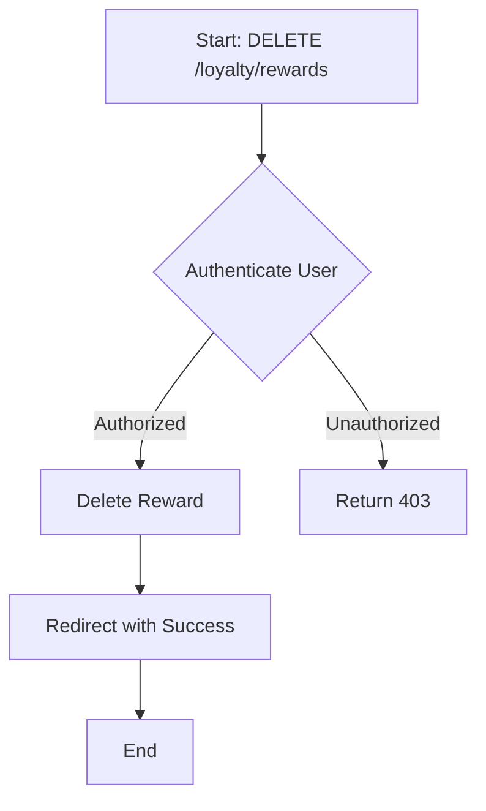
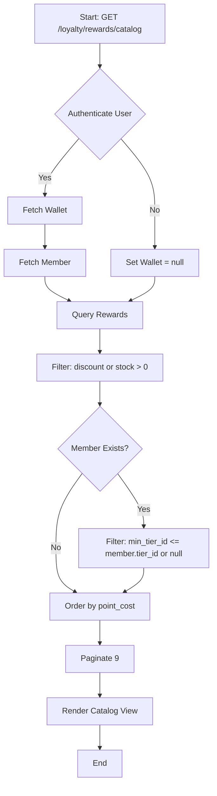

# Reward Management

The reward management module allows you to create, manage, and view rewards that members can redeem using their points.

## Key Components

### Routes

The following routes are defined for managing rewards:

- `GET /loyalty/rewards`: List all rewards.
- `GET /loyalty/rewards/create`: Show form to create a new reward.
- `POST /loyalty/rewards`: Store a new reward.
- `GET /loyalty/rewards/{reward}/edit`: Show form to edit a specific reward.
- `PUT/PATCH /loyalty/rewards/{reward}`: Update a specific reward.
- `GET /loyalty/rewards/{reward}/confirm-delete`: Confirm deletion of a specific reward.
- `DELETE /loyalty/rewards/{reward}`: Delete a specific reward.
- `GET /loyalty/rewards/catalog`: Show catalog of available rewards for authenticated members.

### Controllers

The `RewardController` is responsible for handling reward-related operations. Here are some key methods:

- **Index**
  - `index()`: List all rewards.
  
- **Create**
  - `create()`: Show form to create a new reward. Retrieves all tiers for the dropdown.
  
- **Store**
  - `store(Request $request)`: Store a new reward. Validates input data and creates a new reward.
  
- **Edit**
  - `edit(Reward $reward)`: Show form to edit a specific reward. Retrieves all tiers for the dropdown.
  
- **Update**
  - `update(Request $request, Reward $reward)`: Update a specific reward. Validates input data and updates the reward.
  
- **Confirm Delete**
  - `confirmDelete(Reward $reward)`: Confirm deletion of a specific reward.
  
- **Destroy**
  - `destroy(Reward $reward)`: Delete a specific reward.
  
- **Catalog**
  - `catalog()`: Show catalog of available rewards for authenticated members. Filters rewards based on member's tier and stock availability.

### Entities

The `Reward` entity represents a reward in the system. Here are the key attributes:

- `id`: Unique identifier for the reward.
- `name`: Name of the reward.
- `description`: Description of the reward.
- `point_cost`: Cost of the reward in points.
- `type`: Type of the reward (e.g., discount, product).
- `stock`: Number of items available for the reward.
- `min_tier_id`: Minimum tier ID required to redeem the reward (nullable).

## WORKFLOW
- **List Rewards**:

- **Show Create Reward Form**:

- **Create Reward**:

- **Show Edit Reward Form**:

- **Update Reward**:

- **Delete Reward**:

- **View Reward Catalog**:
