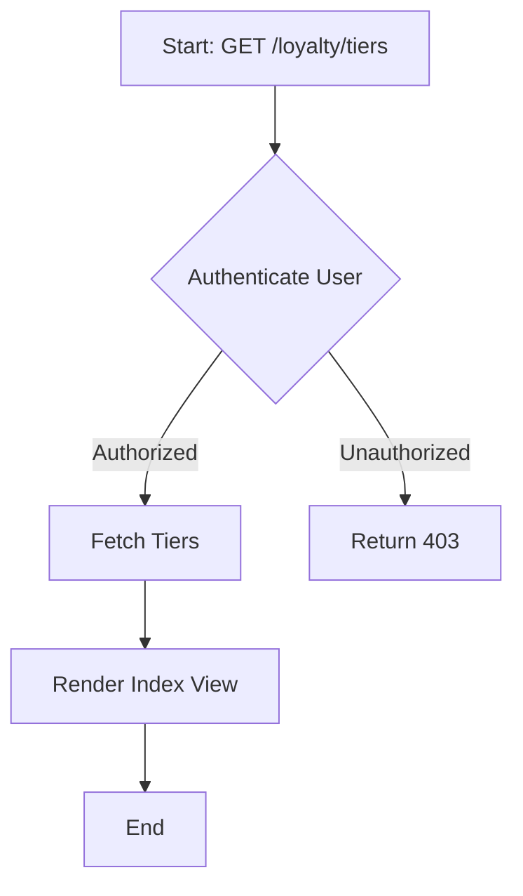
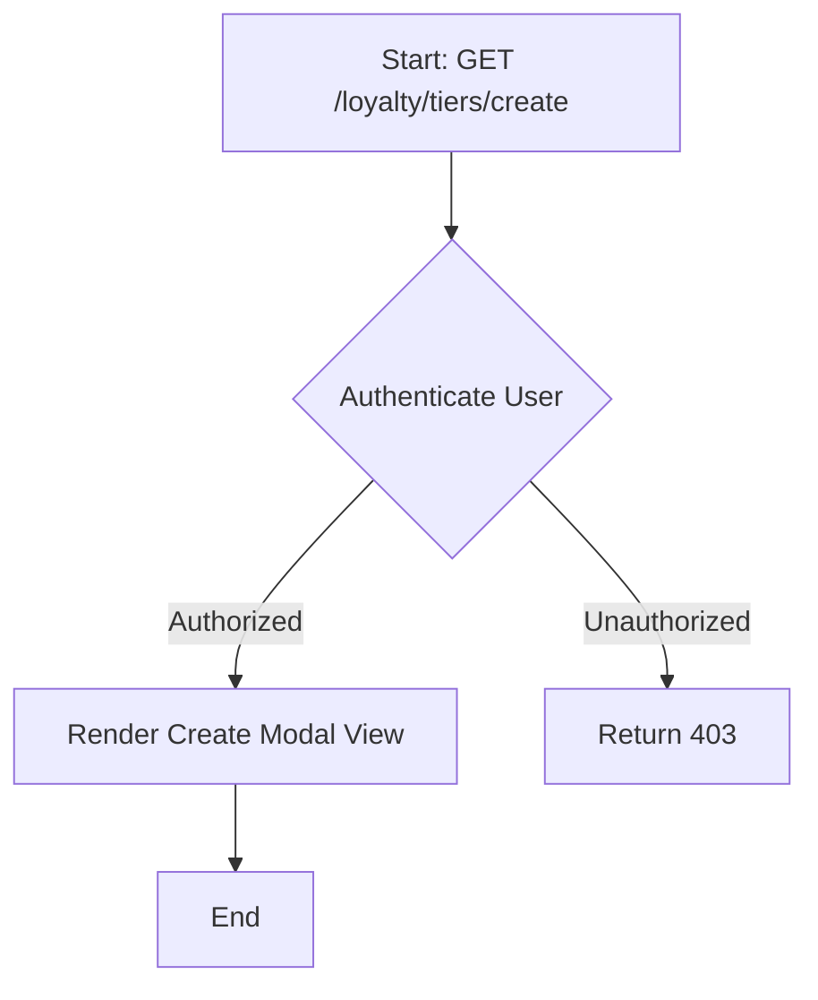
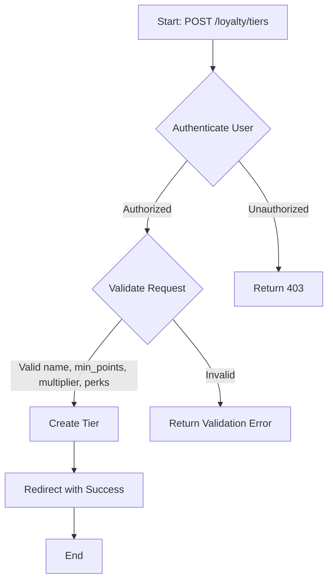
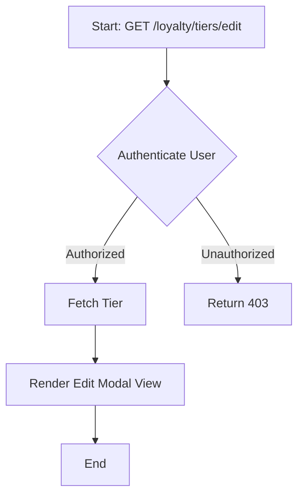
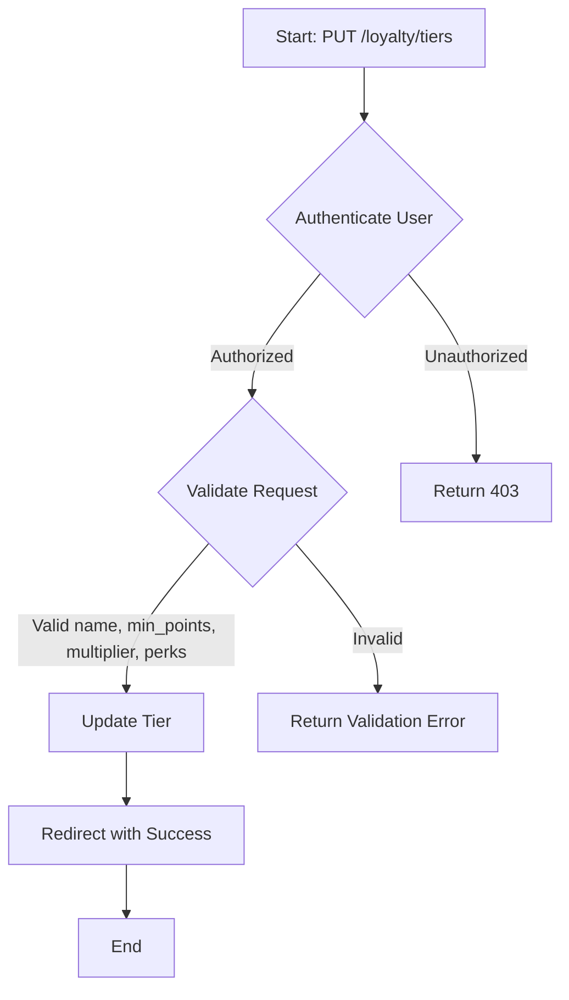

# Tier Management

The tier management module allows you to create, manage, and define different tiers for members based on their points.

## Key Components

### Routes

The following routes are defined for managing tiers:

- `GET /loyalty/tiers`: List all tiers.
- `GET /loyalty/tiers/create`: Show form to create a new tier.
- `POST /loyalty/tiers`: Store a new tier.
- `GET /loyalty/tiers/{tier}/edit`: Show form to edit a specific tier.
- `PUT/PATCH /loyalty/tiers/{tier}`: Update a specific tier.
- `GET /loyalty/tiers/{tier}/confirm-delete`: Confirm deletion of a specific tier.
- `DELETE /loyalty/tiers/{tier}`: Delete a specific tier.

### Controllers

The `TierController` is responsible for handling tier-related operations. Here are some key methods:

- **Index**
  - `index()`: List all tiers.
  
- **Create**
  - `create()`: Show form to create a new tier.
  
- **Store**
  - `store(Request $request)`: Store a new tier.
  
- **Edit**
  - `edit(Tier $tier)`: Show form to edit a specific tier.
  
- **Update**
  - `update(Request $request, Tier $tier)`: Update a specific tier.
  
- **Confirm Delete**
  - `confirmDelete(Tier $tier)`: Confirm deletion of a specific tier.
  
- **Destroy**
  - `destroy(Tier $tier)`: Delete a specific tier.

### Entities

The `Tier` entity represents a tier in the system. Here are the key attributes:

- `id`: Unique identifier for the tier.
- `name`: Name of the tier.
- `min_points`: Minimum points required to reach this tier.
- `multiplier`: Multiplier applied to points earned when in this tier.
- `perks`: Perks associated with this tier (optional).

### Services

The `TierServiceInterface` defines methods for handling tiers:

- **Get Member Tier**
  - `getMemberTier(Member $member): ?Tier`: Get the tier for a specific member.
  
- **Apply Tier Multiplier**
  - `applyTierMultiplier(Member $member, float $points): float`: Apply the tier multiplier to points earned by a member.
  
- **Get All Tiers**
  - `getAllTiers(): Collection<int, Tier>`: Get all tiers in ascending order of required points.
  
- **Get Next Tier**
  - `getNextTier(Member $member): ?Tier`: Get the next tier based on a member's total earned points.

## WORKFLOW
- **List Tiers**:

- **Show Create Tier Form**:

- **Create Tier**:

- **Show Edit Tier Form**:

- **Update Tier**:

- **Delete Tier**:
