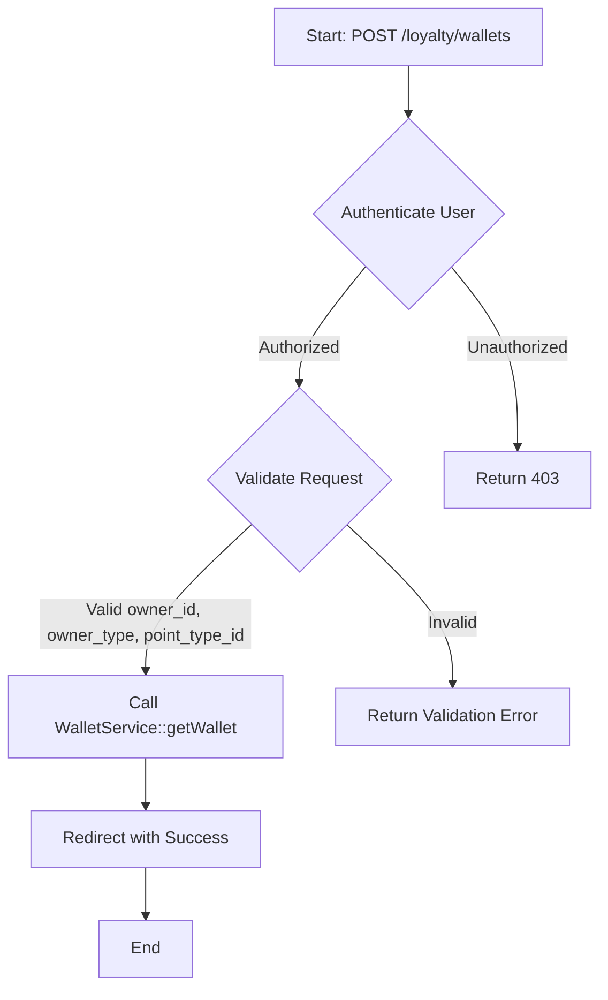
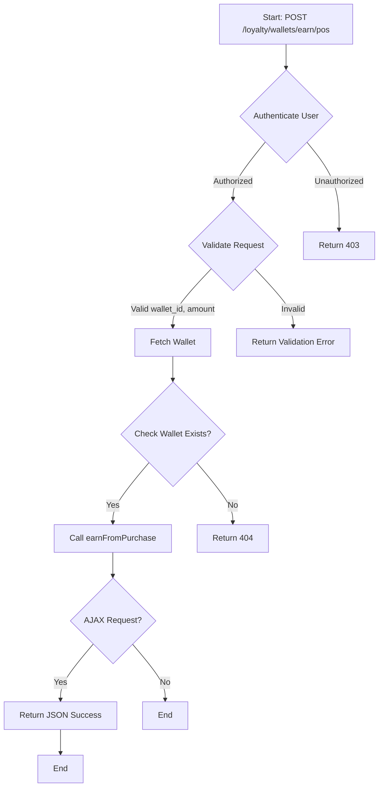
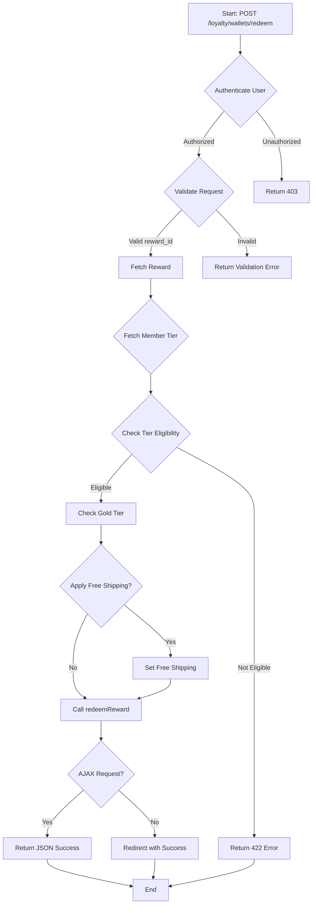
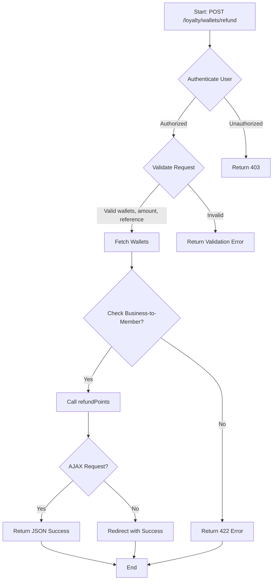
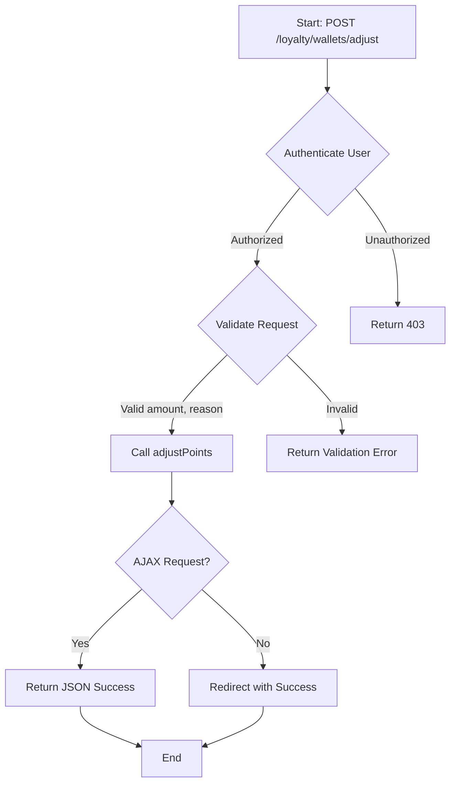
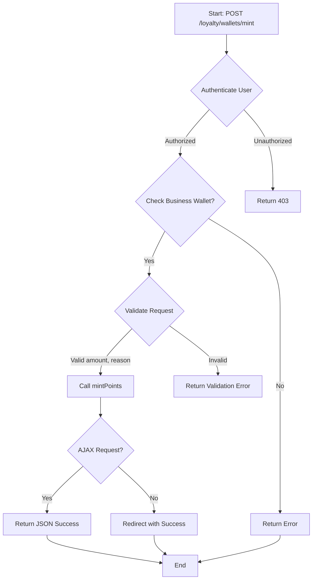
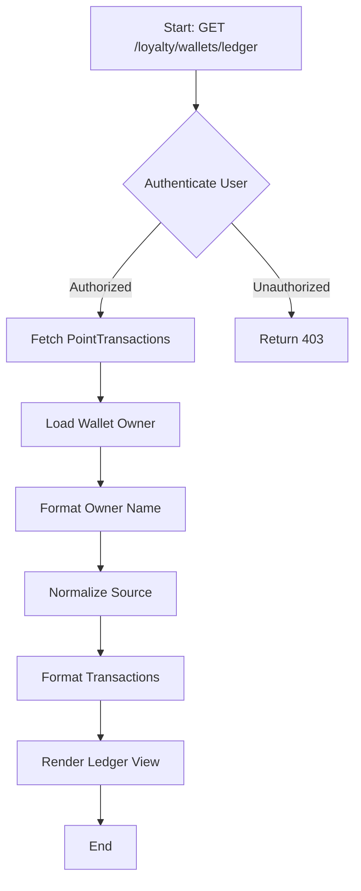

# Wallet Management

Manages wallet operations, including creation, point earning, redemption, refunds, adjustments, minting, and ledger display.

## Key Components

### Routes

The following routes are defined for managing wallet operations:

  - `GET /loyalty/wallets`: List all wallets.
  - `POST /loyalty/wallets`: Create a new wallet.
  - `GET /loyalty/wallets/{wallet}/balance`: Get balance for a specific wallet.
  - `GET /loyalty/wallets/{member}/earn`: Show earn modal for a specific member.
  - `POST /loyalty/wallets/earn/erp`: Earn points from ERP.
  - `POST /loyalty/wallets/earn/pos`: Earn points from POS.
  - `POST /loyalty/wallets/earn/ecommerce`: Earn points from eCommerce.
  - `GET /loyalty/wallets/{wallet}/redeem`: Show redeem modal for a specific wallet.
  - `POST /loyalty/wallets/{wallet}/redeem`: Redeem points for a specific wallet.
  - `GET /loyalty/wallets/{wallet}/refund`: Show refund modal for a specific wallet.
  - `POST /loyalty/wallets/refund`: Refund points.
  - `GET /loyalty/wallets/{wallet}/adjust`: Show adjust modal for a specific wallet.
  - `POST /loyalty/wallets/{wallet}/adjust`: Adjust points for a specific wallet.
  - `GET /loyalty/wallets/{wallet}/mint-modal`: Show mint modal for a specific wallet.
  - `POST /loyalty/wallets/{wallet}/mint`: Mint points for a specific wallet.
  - `GET /loyalty/wallets/{wallet}/ledger`: Show ledger for a specific wallet.
  - `GET /loyalty/wallets/available/{member}`: List available wallets for a specific member.

### Controllers

The `WalletController` manages wallet operations:

- **Index**
  - `index()`: List all wallets.
- **Create**
  - `create(Request $request, WalletServiceInterface $walletService)`: Create a new wallet.
- **Get Balance**
  - `getBalance(Wallet $wallet)`: Get wallet balance.
- **Earn Modal**
  - `earnModal(Member $member)`: Show modal to earn points.
- **Earn Points**
  - `earnFromErp`, `earnFromPos`, `earnFromEcommerce`: Earn points from different channels.
- **Redeem Modal**
  - `redeemModal(Wallet $wallet)`: Show modal to redeem rewards.
- **Redeem Reward**
  - `redeem(Request $request, Wallet $wallet, RewardServiceInterface $rewardService)`: Redeem a reward.
- **Refund Modal**
  - `refundModal(Wallet $wallet)`: Show modal to refund points.
- **Refund Points**
  - `refund(Request $request, PointRefundServiceInterface $refundService)`: Refund points.
- **Adjust Modal**
  - `adjustModal(Wallet $wallet)`: Show modal to adjust points.
- **Adjust Points**
  - `adjust(Request $request, Wallet $wallet, PointAdjustmentServiceInterface $adjustService)`: Adjust points.
- **Mint Modal**
  - `mintModal(Wallet $wallet)`: Show modal to mint points.
- **Mint Points**
  - `mint(Request $request, Wallet $wallet, PointAdjustmentServiceInterface $adjustService)`: Mint points.
- **Ledger**
  - `ledger(Wallet $wallet)`: View wallet transaction ledger.
- **Available Wallets**
  - `availableWallets(Request $request, Member $member)`: Get available member wallets.

### Entities

The `Wallet` entity stores points for members or the business:

- `id`: Unique identifier.
- `owner_id`: ID of the owner (Member or PointType).
- `owner_type`: Type of owner (Member or PointType).
- `point_type_id`: ID of the point type.
- `balance`: Current points balance.
- `is_primary`: Boolean indicating primary wallet.
- `status`: Wallet status (e.g., active).

### Services

The `WalletServiceInterface`, `PointEarningServiceInterface`, `RewardServiceInterface`, `PointRefundServiceInterface`, and `PointAdjustmentServiceInterface` handle wallet and point operations:

- **WalletService**: Creates or retrieves wallets.
- **PointEarningService**: Manages point earning from purchases or other sources.
- **RewardService**: Handles reward redemption.
- **PointRefundService**: Processes point refunds.
- **PointAdjustmentService**: Adjusts or mints points.

## WORKFLOW
- **Create Wallet**: 

- **Earn Points from POS**:

- **Redeem Reward**:

- **Refund Points**:

- **Adjust Points**:

- **Mint Points**:

- **View Ledger**:
